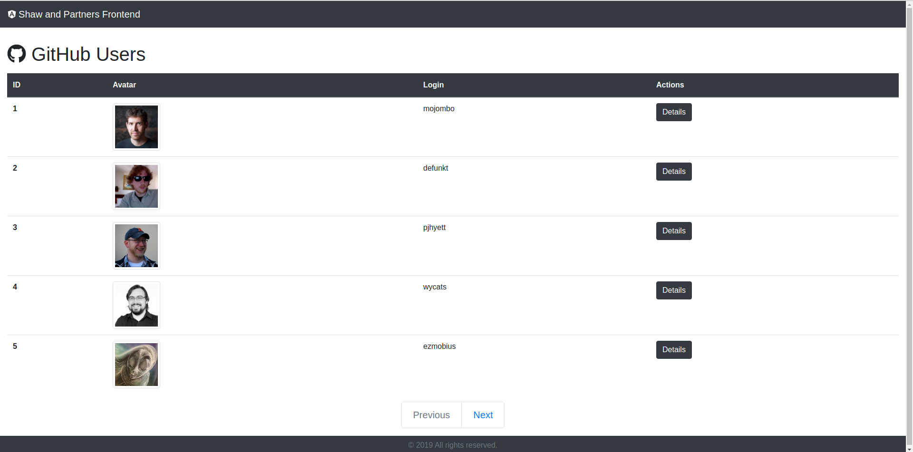
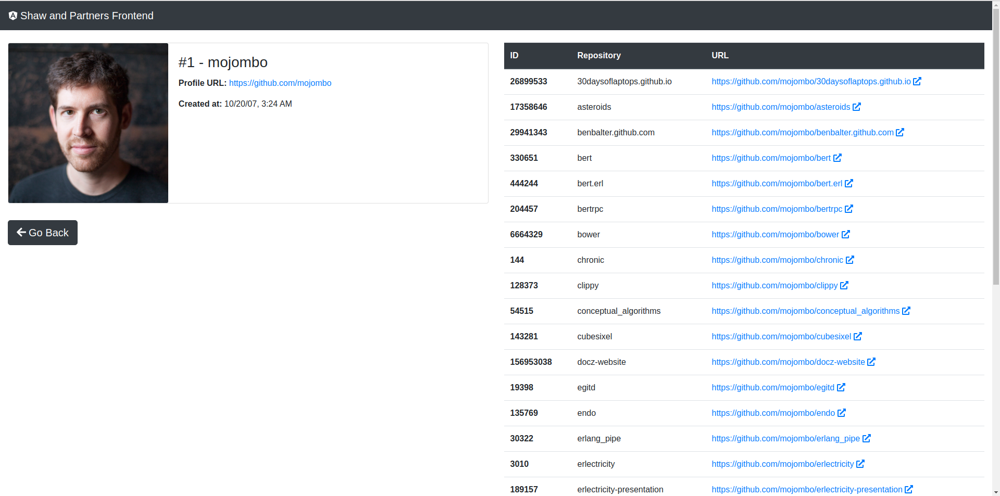

# Shaw and Partners Frontend Test

## Requirements

The specifications was taken from [https://shawandpartners.com/full-back-front-test/](https://shawandpartners.com/full-back-front-test/).

## 3 - [full-stack] [front-end]
Create a screen that will list all users from GitHub and will display their Id and Login. Remember, you can’t list all users at once you will have to use pagination.

(if you are doing this test for the front-end role you have to consume the GitHub endpoints directly)

(if you are doing this test for the full stack role you must consume the endpoints that you created at step 1. )

## 4 - [full-stack] [front-end]
Using the screen created in step 3, create a new screen that will display the details of a user (Id, Login, Profile URL and the date of the login creation).

## 5 - [full-stack] [front-end]
On the details screen (created on step 4) add a table that will display the public repositories of the user, this table must contain the id, name, and URL to the repository.

This project was generated with [Angular CLI](https://github.com/angular/angular-cli) version 8.2.2.

## Development server

Run `ng serve` for a dev server. Navigate to `http://localhost:4200/`. The app will automatically reload if you change any of the source files.

## Code scaffolding

Run `ng generate component component-name` to generate a new component. You can also use `ng generate directive|pipe|service|class|guard|interface|enum|module`.

## Build

Run `ng build` to build the project. The build artifacts will be stored in the `dist/` directory. Use the `--prod` flag for a production build.

## Running unit tests

Run `ng test` to execute the unit tests via [Karma](https://karma-runner.github.io).

## Running end-to-end tests

Run `ng e2e` to execute the end-to-end tests via [Protractor](http://www.protractortest.org/).

## Further help

To get more help on the Angular CLI use `ng help` or go check out the [Angular CLI README](https://github.com/angular/angular-cli/blob/master/README.md).

## Running with Docker

You must have [Docker](https://docs.docker.com/install/) and [Docker Compose](https://docs.docker.com/compose/install/) installed.

In the root project folder build the image and fire up the container:

```bash
$ docker-compose up -d --build
```

Open your browser to http://localhost:4201 and you should see the app. Try making a change to the AppComponent’s template (src/app/app.component.html) within your code editor. You should see the app hot-reload. 

Ensure the app is running in the browser and test hot-reloading again. Try both the unit and e2e tests as well:

```bash
$ docker-compose exec shawandpartners-frontend ng test --watch=false
$ docker-compose exec shawandpartners-frontend ng e2e --port 4202
```

_Obs.: The full test coverage are not implemented._

Stop the container before moving on:

```bash
$ docker-compose stop
```

# Screenshots




# References

- Angular: [https://angular.io/](https://angular.io/)

- Bootstrap: [https://getbootstrap.com/](https://getbootstrap.com/)

- Font Awesome&trade;: [https://fontawesome.com/](https://fontawesome.com/)

- Sass&trade;: [https://sass-lang.com/](https://sass-lang.com/)

- Webpack&trade;: [https://webpack.js.org/](https://webpack.js.org/)

- TypeScript: [https://www.typescriptlang.org/](https://www.typescriptlang.org/)

- Node.js: [https://nodejs.org/](https://nodejs.org/)

# License

Please see the [license agreement](https://github.com/julianomacielferreira/shawandpartners-frontend/blob/master/LICENSE).
